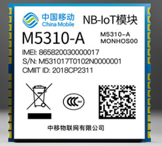

# NB-iot

NB-iot extension base on M5310-A, the same AT+ command set should work across all china mobile nbiot modules~



## Feature

* Common mqtt brokers publish / subscribe
* OneNet mqtt connection and message publish 
* Maker cloud mqtt based value/data publish and subscribe
* IFTTT event trigger

----------

## License

MIT

## Supported targets

* for PXT/microbit
(The metadata above is needed for package search.)

```package
nbiot=github:Kittenbot/pxt-nbiot
```
